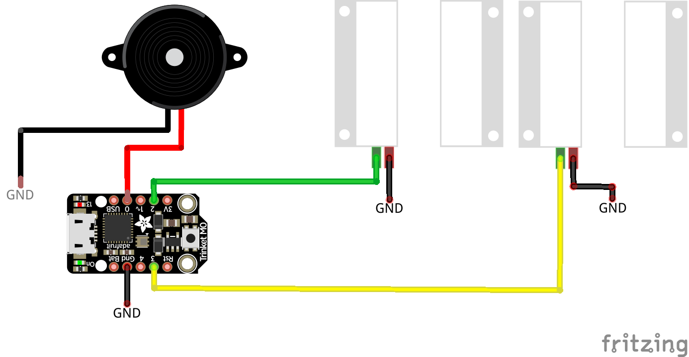
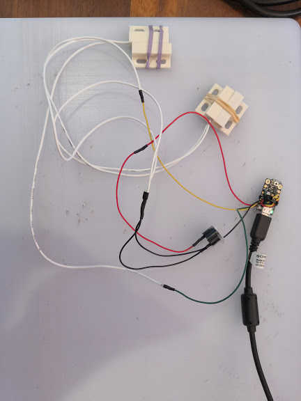

# Fridge Alarm - User guide
Set the variable in sec for timer. If the door is opened for more than xx sec, the buzzer will be triggered
the script is called code.py and should be copied in the root of the circuitpython.
the buzzer is fairly loud and uses 3v. play the wav file to hear how loud it is.

## Dependencies
>adafruit_dotstar module
>simpleio module

## Wire Diagram

## code.py
>Details explaining each column
* **timer**: the time in seconds. How long the doors can stay opened.
* **ledrgb.brightness**: Brightness control for the rgb led on the pcb.

## Pictures

